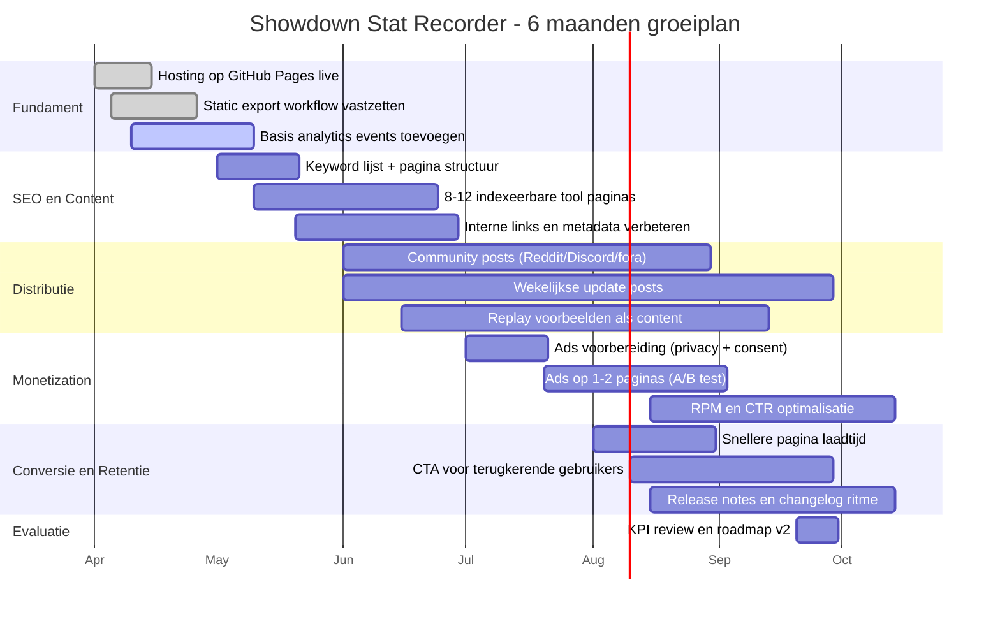

# Maandplanning naar 25k pageviews

Doel: in 6 maanden groeien van 0 naar 25.000 pageviews per maand met zo laag mogelijke kosten.

## Uitgangspunten
- Hosting: GitHub Pages (0 euro)
- Backend: alleen lokaal voor data-verwerking, public site is static export
- Domein: optioneel (ongeveer 10-20 euro per jaar)
- Verdienmodel: advertenties (start pas vanaf maand 3)

## KPI-doelen per maand
| Maand | Doel pageviews | Focus |
|---|---:|---|
| 1 | 1.000 | Basis live, SEO basis, eerste content |
| 2 | 3.000 | Features + indexeerbare paginas |
| 3 | 6.000 | Groei via communities, ads test |
| 4 | 10.000 | Verbeteren CTR en retentie |
| 5 | 16.000 | Schalen content en landingspaginas |
| 6 | 25.000 | Optimaliseren omzet en performance |

## Mermaid planning

## Wat je elke maand minimaal doet
1. Publiceer minimaal 2 zichtbare verbeteringen of nieuwe pagina onderdelen.
2. Deel minimaal 4 community updates met echte voorbeelden.
3. Meet 4 metrics: pageviews, CTR, avg session time, ad RPM.
4. Verwijder of vereenvoudig features die geen verkeer of retentie opleveren.

## Beslismomenten
- Na maand 2: als pageviews lager zijn dan 1.500, focus harder op SEO-landing paginas.
- Na maand 4: als ad RPM lager is dan 0.5 euro, minder ads en meer focus op affiliate/partners.
- Na maand 6: bij 25k+ pageviews kun je veilig extra features bouwen zonder direct verlies.
